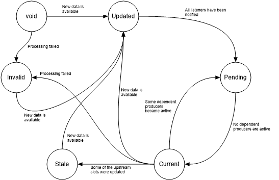

=====================================
The MRP database, slots and producers
=====================================

The system is based on two abstractions of data and processing: *slots* and *producers*.
The slots are linked to entries in a database called MRP table, where the acronymous stands for Market Data, Reports and Parameters.

Slot
----
The slot in an abstraction of a collection of homogeneous data, which is indexed by a string *name* and whose data is indicaed by a date and a collection of supplementary keys.
It is called slot because once data is generated and wrapped in a slot, it is inserted into the MRP table.
Example of slot's name may be *MarketData.Vanilla.Totem* or *ImpliedVolatility.Vanilla.Totem* or *ProductRate.TRS.Totem*.

.. todo::  It is unclear how the slot can be defined, i.e. it represents a homegeneous dataset,
				   but how is the scope determined? For example, option prices
				   should be grouped into a unique slot based on
				   expiry/strike/underlying or just underlying? Probably the grouping
				   should be also determined by the primary keys, so the question is:
				   what are the primary keys for a slot?

				   This must be decided or it won't be possible to handle proxy.

Slots are characterized by a *state*

1. updated
	The slot's data was updated and processing has not started yet
#. pending
	The slot's data has just been generated and all linked producers are processing the data
#. current
	The slot's data has been processed by all the linked producers.
#. invalid
	Some non-recoverable error happened during the processing
#. stale
	At least one of the upstream slots changed status to Failed/Updated/Stale
#. void
	This is the starting state of a slot, when no data has been produced yet

The chart below shows how the state evolves and what triggers changes in the state

Brainstorming
^^^^^^^^^^^^^^
How do we handle proxies, or cases in which many input slots feed into
a fewer numbers of output slots?

To to this there must be a logic that performs aggregation of slots' keys.

The SID
^^^^^^^
Each data in the slot is identified by a unique id the *SID*. This is not a duplicate of the slot's key as the date triggers a new SID.

The Listeners
^^^^^^^^^^^^^^
To each slot is associated a list of producers, or *listeners* in this context,
that has the slot as required or optional, see next section for the definition.
This list is required so that, upon generation of new or updated slots, the
depending producers are notified.

A journey inside the slot life!
^^^^^^^^^^^^^^^^^^^^^^^^^^^^^^^
* A slot is produced and it goes into the table with 'updated' state.
* All listeners are notified and acknowledge the slot was updated
* The listeners also notify the slots they produce of the event, and those slots
  become 'stale'
* The producers perform their job, return the results and notify the slot  of
  their completion
* The triggering slot compare the listed of producers which acknowledged the
  change and the producers which returned the results
* If all producers have performed the task, the slot's status becomes 'current'
* Now one of the slots affering to this slot becomes 'stale'. This slot becomes
  stale too and notified to all producers

Producer
---------
A producer is a process which, given a list of optional input slots, produces a
number of output slots. A producer will always have at least one slot as output.
A producer also must define a list of:

1. Required input slots
	These are the minimum data required by the producer to perform the task. A required slot can be *inclusive* or *exclusive*, which means that the slot must not be available to trigger to producer
2. Provided slots
	The outputs that the producer commits to provided. The producer assigns to each output slot a priority. No other producer may not output the same slot with equal priority.
3. Optional slots
	The are slots that may improve the quality of the outputs but are not strictly necessary for the producer to run.

Furthermore, each running producer is identified by a unique id the *PID*

Producer types
^^^^^^^^^^^^^^^

There are different type of producers:

* Demoniac producers
	This producer is constantly running in the background. Example of this type of producers is the *Totem Producer*, which continuously polls for new data from Totem
* Non-demoniac producers
	They have limited life span and terminate once all output slots are produced

Producer output
^^^^^^^^^^^^^^^
Apart from the output slots, the data generated by the processing, the producer must return the input slots' used for the production of each output slot.
This is needed to build a dependency tree. Indeed, once the producer output is processed and output slots' stored in the MRP table, the dependency tree SLOT_TREE must
be updated accordingly.

Producer Proxy
^^^^^^^^^^^^^^
All producers are executed through a common interface called *Producer Proxy*.
Proxies are divided into

* Multi-threaded (MT) Proxies
	Producers are not executed in a different process. For example, producers which simply aggregates or filters data can be run in a separated thread. Note that producers accessing analytic funcionality (CAL, Zuul) may not be multi-treaded producers
* Multi-processing (MP) Proxies
	Producers are executed in their own process and potentially in a different machines

The Proxy is responsible for join togheter all the slots needed for the producer to run.
A set on joined slots constitute an *bundle*.
An bundle is a collection of slots required to produce at least one output slot. For example, implied volatility and forward for asset A constitutes a bundle for the volatiity fitting producer

A further differentiation is in

* *Independent* Proxies
	Producers are executed as soon as bundles are available, but subject to batch
	sizes MIN_BATCH.

.. todo:: Add example of Independent Proxies

* *Dependant* Proxies
	Producers are triggered once all the input slots' producers are terminated.
	This type of prxy is needed to execute methodologies based on the whole
	aggregated data, for example calcuation of VarSwap basis. For Dependant Proxies MIN_BATCH=9999

In order for Proxy to work, they must:

* Receive notification of changes in status of required and optional slots
* Aggregate the slots into atoms.
* Trigger the actual producer once a set of conditions are met

The conditions to be satisfied to trigger a calculation are:

* The number of available atoms are more than MIN_BATCH > 0.
* The number of available atoms is less than MIN_BATCH but the atoms have been available for more than MAX_WAIT_TIME.
* The proxy is Dependent and all the input slots' producers have terminated

MRP DB
----------
The MRP database is needed in order to:

* Synchronize the access to the data from different processes running of different machines
* Persist the slot's states
* Keep track of slot's dependency trees
* Keep track of running producers
* Joining the slot's data to be feed to the producers

In the following, the required table are listed

SLOT_TABLE
^^^^^^^^^^
Keeps track of existing slots and register them with the SID.
Columns are:

* SLOT_NAME Name of the slot, for example MarketData.Vanilla.Totem
* DATE The valuation date
* SLOT_KEY This is a string made up of the slot's keys joined by '/, for example '0123456/EURO/INDEX'
* SID The unique identifier
* SSTATUS
* FILE

SLOT_TREE
^^^^^^^^^

Slot's dependency tree. This is required to invalidate downstream slots (state set to 'stale') upon slot's update

* SID1 SID of the slot
* SID2 SID of a slot depending on SID1

RUNNING_PROD
^^^^^^^^^^^^

The table of the running producers

* PROD_NAME The producer name
* PID The producer unique id
* MACHINE The machine where the producer is running
* START_TIME The time when the producer was kicked off
* SID The slots being produced

SLOTs Tables
^^^^^^^^^^^^

Each slot is associated with a table with same name as the slot, with '.' replaced by '_'.
The tables have columns which are specific to the relative slot, apart a few which are fixed:

* DATE The valuation date
* SID The id from the SLOTS_TABLE
* LAST_UPDATED The last update time
* PRODUCER The producer that created the data
* PRIORITY The producer's priority
* Set of specific keys that identifies the item itself. In SQL parlance, these are *primary keys*.

PRODUCERs Tables
Each producers is associated with a list of slots which where notified to the producers and accepted.

* SID the id from the slot_table
* PSTATUS status of the processing ('pending','processing')
