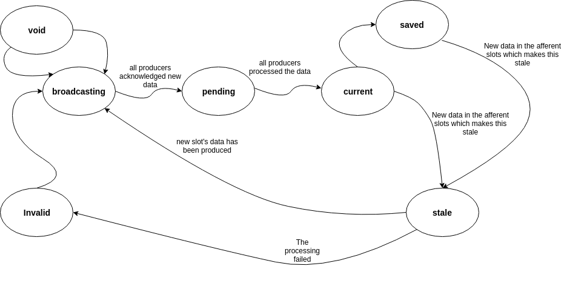
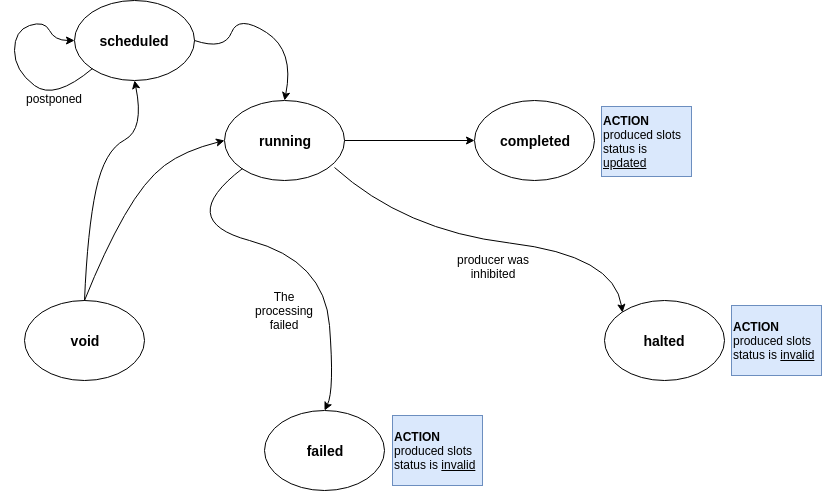

======================================
The MRPR database, slots and producers
======================================

The system is based on two abstractions of data and processing: *slots* and *producers*.
The slots are linked to entries in a database called MRP table, where the acronyms
stands for Market Data, Reports, Parameters and Risk.

Slot
----
The slot in an abstraction of a collection of homogeneous data, which is
indexed by a string *name* and whose data is indicated by a date and a
collection of supplementary keys.
It is called slot because once data is generated and wrapped in a slot, it is
inserted into the MRP table. Example of slot's name may be
**MarketData.Vanilla.Totem** or **ImpliedVolatility.Vanilla.Totem** or
**ProductRate.TRS.Totem**.

.. todo::  It is unclear how the slot can be defined, i.e. it represents a
           homogeneous dataset, but how is the scope determined? For example, option prices
           should be grouped into a unique slot based on
           expiry/strike/underlying or just underlying? Probably the grouping
           should be also determined by the primary keys, so the question is:
           what are the primary keys for a slot?

				   This must be decided or it won't be possible to handle proxy.

Slot types
^^^^^^^^^^
These are the types:

1. Report
    This represents producers' report, for example back-testing results.
#. MarketData
    As the name says - contains market data
#. Parameter
    Represents calibrated parameters - model inputs but also spreads to be
    used for Proxies.
#. Risk
    Represents risk. The aggregation should be at underlying level, though
    the data itself should have expiry granularity.

      .. todo:: It must still be defined what risk should be considered here.

                1. Tau
                #. EquityRho
                #. Dividends
                #. VarSwapVolBasis risk
                #. dTvdVolOfVolATMBackward
                #. VarSwapVIXBasis risk
                #. dTvdLVSVVolOfVol

.. note:: How do we ensure that the calibrated parameters are used consistently?

          Usually it is not a problem, unless the parameters are calibrated
          for the same market data.

          For example, some underlying may have product rate and divs calibrated
          from Vanilla prices, other from DivSwap + Vanilla, other from TRS +
          DivSwap, other from TRS + Vanilla.
          One approach could be based on **priority**. For product rate could be:

          1. Vanilla only      -> ProductRate=0, Dividends=0
          2. DivSwap + Vanilla -> ProductRate=1, Dividends=1
          3. TRS + Vanilla     -> ProductRate=2, Dividends=2

          It seems that it is the methodologies that set the priority in case
          it calibrate multiple parameters.

Slots states
^^^^^^^^^^^^
Slots are characterized by a **state**:

1. broadcasting
	  The slot's data was updated and processing has not started yet. We need This
	  state to **trigger** Producers, for example when the system is restarted
#. pending
	  The slot's data has just been generated and all linked producers are processing
	  the data
#. current
	  The slot's data has been processed by all the linked producers.
#. saved
    The slot's data was saved to the database(s)
#. invalid
	  Some non-recoverable error happened during the processing
#. stale
	  At least one of the upstream slots changed status to Failed/Updated/Stale
#. void
	  This is the starting state of a slot, when no data has been produced yet

.. warning:: The slots' state is a mess, we need clarity, and a clear definition
             of what those states really mean!!!

The chart below shows how the state evolves and what triggers changes in the
state

Brainstorming
^^^^^^^^^^^^^
How do we handle proxies, or cases in which many input slots feed into
a fewer numbers of output slots?

To to this there must be a logic that performs aggregation of slots' keys.

.. warning:: Some slots may need to be linked, for example product rate and
             dividends are related. **THIS WAS ADDRESSED BY THE PRIORITY!**

The SID
^^^^^^^
Each data in the slot is identified by a unique id the *SID*. This is not a
duplicate of the slot's key as the date triggers a new SID.

The Listeners
^^^^^^^^^^^^^^
To each slot is associated a list of producers, or *listeners* in this context,
that has the slot as required or optional, see next section for the definition.
This list is required so that, upon generation of new or updated slots, the
depending producers are notified.

A journey inside the slot life!
^^^^^^^^^^^^^^^^^^^^^^^^^^^^^^^
* A slot is produced and it goes into the table with 'updated' state.
* All listeners are notified and acknowledge the slot was updated
* The listeners also notify the slots they produce of the event, and those slots
  become 'stale'
* The producers perform their job, return the results and notify the slot  of
  their completion
* The triggering slot compare the listed of producers which acknowledged the
  change and the producers which returned the results
* If all producers have performed the task, the slot's status becomes 'current'
* Now one of the slots feeding into this slot becomes 'stale'. This slot becomes
  stale too and notified to all producers

Producer
---------
A producer is a process which, given a list of optional input slots, produces a
number of output slots. A producer will always have at least one slot as output.
A producer also must define a list of:

1. Required input slots
	These are the minimum data required by the producer to perform the task.
	A required slot can be **inclusive** or **exclusive**, which means that the
	slot must not be available to trigger to producer. A required slot can then
	be **fault_tolerant**, i.e. failed slots are still considered for joining
	operation, otherwise a failed input slot make stale all produced slots.
	This differentiation is needed to handle proxies.

2. Filters
	Filters are applied to the slots' key to restrict the Producer activities
	to a narrower set of slots.
3. Provided slots
	The outputs that the producer commits to provided. The producer assigns to
	each output slot a priority. No other producer may not output the same slot
	with equal priority.

Furthermore, each running producer is identified by a unique id or **pid**

.. note:: The "Optional Slots" have been **removed**. That behavior can be
          simulating adding new producers having those optional slots as required.

Producer states
^^^^^^^^^^^^^^^
The diagram below shows the state diagram for the producer:

.. note:: The **scheduled** state was introduced to handle methodologies
          based on aggregation of data (for example proxy). For those, it is
          pointless kicking-off new producers as soon as new data is available.
          Better to schedule, i.e. delay, the processing for a while as very
          likely new data will become available in the meanwhile.

Brainstorming
^^^^^^^^^^^^^
The producer is a template for actual running methodologies. It establishes
relationship with data and how slots are aggregated. But running producers are
*instance* of the producer template.

Producer types
^^^^^^^^^^^^^^^

There are different type of producers:

* Demoniac producers
	This producer is constantly running in the background. Example of this type
	of producers is the *Totem Producer*, which continuously polls for new data
	from Totem
* Non-demoniac producers
	They have limited life span and terminate once all output slots are produced

Producer output
^^^^^^^^^^^^^^^
Apart from the output slots, the data generated by the processing, the producer
must return the input slots' used for the production of each output slot.
This is needed to build a dependency tree. Indeed, once the producer output is
processed and output slots' stored in the MRP table, the dependency tree
SLOT_TREE must be updated accordingly.

Producer Proxy
^^^^^^^^^^^^^^
All producers are executed through a common interface called *Producer Proxy*.
Proxies are divided into

* Multi-threaded (MT) Proxies
	Producers are not executed in a different process. For example, producers
	which simply aggregates or filters data can be run in a separated thread.
	Note that producers accessing analytic funcionality (CAL, Zuul) may not be
	multi-treaded producers
* Multi-processing (MP) Proxies
	Producers are executed in their own process and potentially in a different
	machines

The Proxy is responsible for join together all the slots needed for the producer to run.
A set on joined slots constitute an *parcel*.
An parcel is a collection of slots required to produce at least one output slot. For example, implied volatility and forward for asset A constitutes a parcel for the volatiity fitting producer

A further differentiation is in

* *Independent* Proxies
	Producers are executed as soon as parcels are available, but subject to batch
	sizes MIN_BATCH.

.. todo:: Add example of Independent Proxies

* *Dependent* Proxies
	Producers are triggered once all the input slots' producers are terminated.
	This type of proxy is needed to execute methodologies based on the whole
	aggregated data, for example calculation of VarSwapVolBasis. For Dependent
	Proxies MIN_BATCH=9999

In order for Proxy to work, they must:

* Receive notification of changes in status of required and optional slots
* Aggregate the slots into parcels.
* Trigger the actual producer once a set of conditions are met

The conditions to be satisfied to trigger a calculation are:

* The number of available parcels are more than MIN_BATCH > 0.
* The number of available parcels is less than MIN_BATCH but the parcels have been
  available for more than MAX_WAIT_TIME.
* The proxy is Dependent and all the input slots' producers have terminated

A journey inside the producer life!
^^^^^^^^^^^^^^^^^^^^^^^^^^^^^^^^^^^
A slot is completed. It notifies this to the producer, which is one of the
listeners, by communicating the sid.
The producer acknowledges it (do we really need this? **Yes I do!** This is
required to sort out the issue with notifying producer with updated data) and
registers the
new available data. It then checks whether it has received the required number
of slots. If it does, then parcel is sent for processing. Now, it can happen
that one of the input slots becomes invalid, or than a new optional slot
becomes available. In this case the producer is inhibited. A signal is sent
to the running producer. Once the producer returns the output, either because
it stopped processing upon inhibition signal or because it terminated is job,
that output is simply neglected but the output slot must be set to **invalid.**
Why we need this? Not sure, let's assume we need to flag the failure.

Joining slots into parcels - proposal
^^^^^^^^^^^^^^^^^^^^^^^^^^^^^^^^^^^^^

1. a slot is received
#. if the new slow has higher priority that same slot already
   stored in the parcels_table, then the new slot is inserted
#. consider all the producers affected
#. join the required slots together
#. **projects** the keys on the producer aggregation keys.
   This is the key point: we know upfront which producers are affected
#. select all the slots with keys on each distinct projection
#. If a producer with that aggregation still running then inhibits it before
   starting the new one

.. note:: steps 2-6 must be in a separate function, which may be possible to
          call for example by a scheduler.

.. note:: to joining at step 3 may not be required, but at the moment it
          seems required to process batches of different slots, for example
          for proxies calculation

.. warning :: A tricky aspect is that the calculation is triggered by an event!
              So for example this makes difficult to restart from a crash.
              This can be addressed leveraging on the slot **updated** status. So
              slots which are **pending** can have their status overridden to
              **updated**.

Examples
^^^^^^^^
VarSwapVolBasis calculation
+++++++++++++++++++++++++++

::

	required_slots = (Totem.VarSwapVolBasis,)
	output_slots = (Totem.VarSwapVolBasisProxy,)
	producer_key = 'product_type|region'
